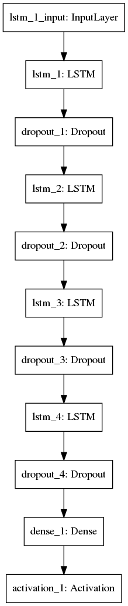

# PyCodeComplete
Python code predictions using a Recurrent Neural Network

## Motivation
Programmers spend a considerable amount of time fixing errors due to typos, retyping the same lines of code of a
common task, or typing boilerplate code. PyCodeComplete increases a programmer's productivity by provding auto-complete
suggestions to reduce the number of typos and the amount of repetitve typing.

## Product
The user interface for PyCodeComplete allows a programmer to start typing Python code and receive immediate auto-complete
suggestions that the programmer can then implement in his or her project. By using the auto-complete suggestions the
user can save time and avoid errors.

The code suggestions are provided by a Recurrent Nerual Network (RNN) that was trained on 1000 Python projects taken from
GitHub. 

## Gathering and Cleaning Data

Using the [GitHub GraphQL API v4](https://developer.github.com/v4/) I performed query to search for Python repositiories.
To ensure that only high quality Python code is used to train the RNN, I limited the seach to repositioreies with over
1000 stars. The query results are an stored on Amazon Aurora Relational Database with the following columns:

* Repository Name
* Owner
* Name With Owner
* Disk Usage
* Project's Url,
* SSH Url,
* Fork Count
* Star Count
* Watcher Count

After the repository metadata is collected I use [GitPython](https://github.com/gitpython-developers/GitPython) to clone
the repository to an Amazon AWS EC2 instance. Non-Python files are deleted to save space, since the RNN is only trained on
and predicts Python code.

In total, I collected 2.4Gb of data totaling 185,580 .py files containing 400,383 lines, 1,337,590 words, 16,056,221 characters of code

## Data Preparation
The RNN is trained on a sequence of 100 characters. Training was performed on an [g2.8xlarge AWS EC2 instance](https://aws.amazon.com/ec2/instance-types/),
with 4 NVIDIA GRID K520 GPUs. This allowed me to train the RNN on batches of 512 of these sequences at a time.

During training, batches are generated as follows:

1. Read the next .py file from the collection of GitHub repositiories
2. Encode the each character as a one-hot encoded vector of length 100, since I limited the allowable charcters to 
   python's strings.printable list of 100 characters. For example, the character 'a' is encoded as a 100 dimensional vector
   with all 0's with the exception of the 11th component which is 1.
3. 100 characters are assembled into a numpy array, resulting in a feature matrix of shape 100 x 100.
4. The target for this 100 x 100 feature matrix is the encoded 101st character
5. Because of memory limitations. A batch of 512 sequences and targets are prepared for each epoch.

## Modeling



## Usage

Clone this repository with the command
```
git clone https://github.com/kevinafrica/pycodecomplete.git
```
GitHub scr


## Future Work


## References

  [1] <div class="csl-entry">“A Ten-Minute Introduction to Sequence-to-Sequence Learning in Keras.” Accessed August 14, 2018. <a href="https://blog.keras.io/a-ten-minute-introduction-to-sequence-to-sequence-learning-in-keras.html">https://blog.keras.io/a-ten-minute-introduction-to-sequence-to-sequence-learning-in-keras.html</a>.</div>
  <span class="Z3988" title="url_ver=Z39.88-2004&amp;ctx_ver=Z39.88-2004&amp;rfr_id=info%3Asid%2Fzotero.org%3A2&amp;rft_val_fmt=info%3Aofi%2Ffmt%3Akev%3Amtx%3Adc&amp;rft.type=webpage&amp;rft.title=A%20ten-minute%20introduction%20to%20sequence-to-sequence%20learning%20in%20Keras&amp;rft.identifier=https%3A%2F%2Fblog.keras.io%2Fa-ten-minute-introduction-to-sequence-to-sequence-learning-in-keras.html"></span>
  <div class="csl-entry">Andrej. <i>Char-Rnn: Multi-Layer Recurrent Neural Networks (LSTM, GRU, RNN) for Character-Level Language Models in Torch</i>. Lua, 2018. <a href="https://github.com/karpathy/char-rnn">https://github.com/karpathy/char-rnn</a>.</div>
  <span class="Z3988" title="url_ver=Z39.88-2004&amp;ctx_ver=Z39.88-2004&amp;rfr_id=info%3Asid%2Fzotero.org%3A2&amp;rft_val_fmt=info%3Aofi%2Ffmt%3Akev%3Amtx%3Adc&amp;rft.type=computerProgram&amp;rft.title=char-rnn%3A%20Multi-layer%20Recurrent%20Neural%20Networks%20(LSTM%2C%20GRU%2C%20RNN)%20for%20character-level%20language%20models%20in%20Torch&amp;rft.identifier=https%3A%2F%2Fgithub.com%2Fkarpathy%2Fchar-rnn&amp;rft.aulast=Andrej&amp;rft.au=Andrej&amp;rft.date=2018-08-13"></span>
  <div class="csl-entry">“GitHub GraphQL API V4.” GitHub Developer. Accessed August 29, 2018. <a href="https://developer.github.com/v4/">https://developer.github.com/v4/</a>.</div>
  <span class="Z3988" title="url_ver=Z39.88-2004&amp;ctx_ver=Z39.88-2004&amp;rfr_id=info%3Asid%2Fzotero.org%3A2&amp;rft_val_fmt=info%3Aofi%2Ffmt%3Akev%3Amtx%3Adc&amp;rft.type=webpage&amp;rft.title=GitHub%20GraphQL%20API%20v4&amp;rft.description=Get%20started%20with%20one%20of%20our%20guides%2C%20or%20jump%20straight%20into%20the%20API%20documentation.&amp;rft.identifier=https%3A%2F%2Fdeveloper.github.com%2Fv4%2F&amp;rft.language=en"></span>
  <div class="csl-entry">“GitPython Documentation — GitPython 2.1.11 Documentation.” Accessed August 29, 2018. <a href="https://gitpython.readthedocs.io/en/stable/">https://gitpython.readthedocs.io/en/stable/</a>.</div>
  <span class="Z3988" title="url_ver=Z39.88-2004&amp;ctx_ver=Z39.88-2004&amp;rfr_id=info%3Asid%2Fzotero.org%3A2&amp;rft_val_fmt=info%3Aofi%2Ffmt%3Akev%3Amtx%3Adc&amp;rft.type=webpage&amp;rft.title=GitPython%20Documentation%20%E2%80%94%20GitPython%202.1.11%20documentation&amp;rft.identifier=https%3A%2F%2Fgitpython.readthedocs.io%2Fen%2Fstable%2F"></span>
  <div class="csl-entry"><i>Keras: Deep Learning for Humans</i>. Python. 2015. Reprint, Keras, 2018. <a href="https://github.com/keras-team/keras">https://github.com/keras-team/keras</a>.</div>
  <span class="Z3988" title="url_ver=Z39.88-2004&amp;ctx_ver=Z39.88-2004&amp;rfr_id=info%3Asid%2Fzotero.org%3A2&amp;rft_val_fmt=info%3Aofi%2Ffmt%3Akev%3Amtx%3Adc&amp;rft.type=computerProgram&amp;rft.title=keras%3A%20Deep%20Learning%20for%20humans&amp;rft.identifier=https%3A%2F%2Fgithub.com%2Fkeras-team%2Fkeras&amp;rft.date=2018-08-21"></span>
  <div class="csl-entry">“Keras Documentation.” Accessed August 29, 2018. <a href="https://keras.io/">https://keras.io/</a>.</div>
  <span class="Z3988" title="url_ver=Z39.88-2004&amp;ctx_ver=Z39.88-2004&amp;rfr_id=info%3Asid%2Fzotero.org%3A2&amp;rft_val_fmt=info%3Aofi%2Ffmt%3Akev%3Amtx%3Adc&amp;rft.type=webpage&amp;rft.title=Keras%20Documentation&amp;rft.identifier=https%3A%2F%2Fkeras.io%2F"></span>
  <div class="csl-entry">Moses, Caleb. <i>Keras-Char-Rnn: A Keras Implementation of Andrej Karpathy’s Char-Rnn Model in Python. Based on Keras with the TensorFlow Backend</i>. Jupyter Notebook, 2018. <a href="https://github.com/mathematiguy/keras-char-rnn">https://github.com/mathematiguy/keras-char-rnn</a>.</div>
  <span class="Z3988" title="url_ver=Z39.88-2004&amp;ctx_ver=Z39.88-2004&amp;rfr_id=info%3Asid%2Fzotero.org%3A2&amp;rft_val_fmt=info%3Aofi%2Ffmt%3Akev%3Amtx%3Adc&amp;rft.type=computerProgram&amp;rft.title=keras-char-rnn%3A%20A%20Keras%20implementation%20of%20Andrej%20Karpathy's%20char-rnn%20model%20in%20Python.%20Based%20on%20Keras%20with%20the%20TensorFlow%20backend&amp;rft.rights=GPL-3.0&amp;rft.identifier=https%3A%2F%2Fgithub.com%2Fmathematiguy%2Fkeras-char-rnn&amp;rft.aufirst=Caleb&amp;rft.aulast=Moses&amp;rft.au=Caleb%20Moses&amp;rft.date=2018-08-10"></span>
  <div class="csl-entry">Ozair, Sherjil. <i>Char-Rnn-Tensorflow:&nbsp; Multi-Layer Recurrent Neural Networks (LSTM, RNN) for Character-Level Language Models in Python Using Tensorflow</i>. Python, 2018. <a href="https://github.com/sherjilozair/char-rnn-tensorflow">https://github.com/sherjilozair/char-rnn-tensorflow</a>.</div>
  <span class="Z3988" title="url_ver=Z39.88-2004&amp;ctx_ver=Z39.88-2004&amp;rfr_id=info%3Asid%2Fzotero.org%3A2&amp;rft_val_fmt=info%3Aofi%2Ffmt%3Akev%3Amtx%3Adc&amp;rft.type=computerProgram&amp;rft.title=char-rnn-tensorflow%3A%20%20Multi-layer%20Recurrent%20Neural%20Networks%20(LSTM%2C%20RNN)%20for%20character-level%20language%20models%20in%20Python%20using%20Tensorflow&amp;rft.rights=MIT&amp;rft.identifier=https%3A%2F%2Fgithub.com%2Fsherjilozair%2Fchar-rnn-tensorflow&amp;rft.aufirst=Sherjil&amp;rft.aulast=Ozair&amp;rft.au=Sherjil%20Ozair&amp;rft.date=2018-08-21"></span>
  <div class="csl-entry">“Sequence-to-Sequence Models.” TensorFlow. Accessed August 14, 2018. <a href="https://www.tensorflow.org/versions/r1.2/tutorials/seq2seq">https://www.tensorflow.org/versions/r1.2/tutorials/seq2seq</a>.</div>
  <span class="Z3988" title="url_ver=Z39.88-2004&amp;ctx_ver=Z39.88-2004&amp;rfr_id=info%3Asid%2Fzotero.org%3A2&amp;rft_val_fmt=info%3Aofi%2Ffmt%3Akev%3Amtx%3Adc&amp;rft.type=webpage&amp;rft.title=Sequence-to-Sequence%20Models&amp;rft.identifier=https%3A%2F%2Fwww.tensorflow.org%2Fversions%2Fr1.2%2Ftutorials%2Fseq2seq&amp;rft.language=en"></span>
  <div class="csl-entry">“The Unreasonable Effectiveness of Recurrent Neural Networks.” Accessed August 6, 2018. <a href="http://karpathy.github.io/2015/05/21/rnn-effectiveness/">http://karpathy.github.io/2015/05/21/rnn-effectiveness/</a>.</div>
  <span class="Z3988" title="url_ver=Z39.88-2004&amp;ctx_ver=Z39.88-2004&amp;rfr_id=info%3Asid%2Fzotero.org%3A2&amp;rft_val_fmt=info%3Aofi%2Ffmt%3Akev%3Amtx%3Adc&amp;rft.type=webpage&amp;rft.title=The%20Unreasonable%20Effectiveness%20of%20Recurrent%20Neural%20Networks&amp;rft.identifier=http%3A%2F%2Fkarpathy.github.io%2F2015%2F05%2F21%2Frnn-effectiveness%2F"></span>


## License
MIT License

Copyright (c) 2018 Kevin Africa

Permission is hereby granted, free of charge, to any person obtaining a copy
of this software and associated documentation files (the "Software"), to deal
in the Software without restriction, including without limitation the rights
to use, copy, modify, merge, publish, distribute, sublicense, and/or sell
copies of the Software, and to permit persons to whom the Software is
furnished to do so, subject to the following conditions:

The above copyright notice and this permission notice shall be included in all
copies or substantial portions of the Software.

THE SOFTWARE IS PROVIDED "AS IS", WITHOUT WARRANTY OF ANY KIND, EXPRESS OR
IMPLIED, INCLUDING BUT NOT LIMITED TO THE WARRANTIES OF MERCHANTABILITY,
FITNESS FOR A PARTICULAR PURPOSE AND NONINFRINGEMENT. IN NO EVENT SHALL THE
AUTHORS OR COPYRIGHT HOLDERS BE LIABLE FOR ANY CLAIM, DAMAGES OR OTHER
LIABILITY, WHETHER IN AN ACTION OF CONTRACT, TORT OR OTHERWISE, ARISING FROM,
OUT OF OR IN CONNECTION WITH THE SOFTWARE OR THE USE OR OTHER DEALINGS IN THE
